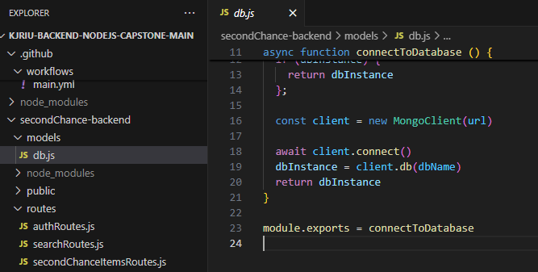
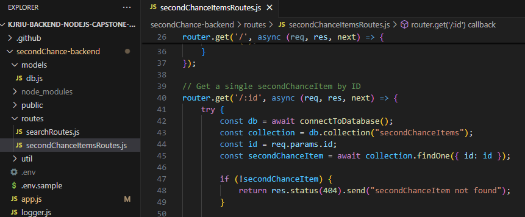
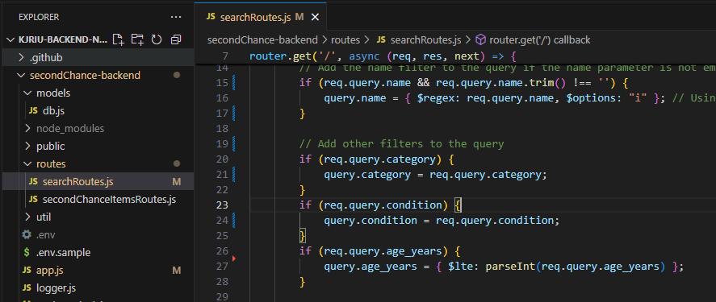
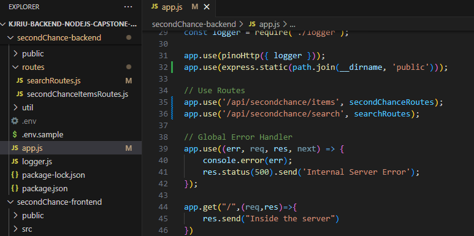
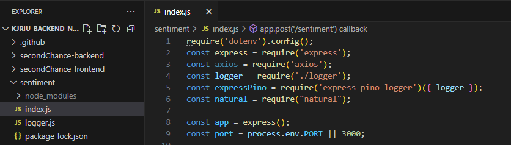
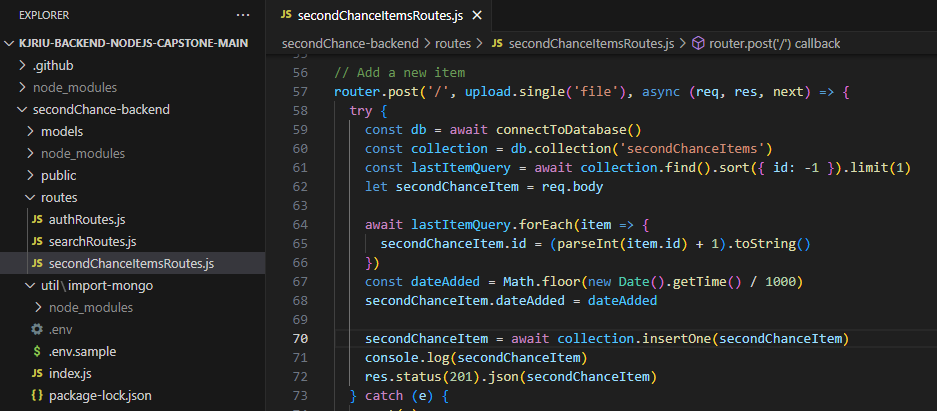
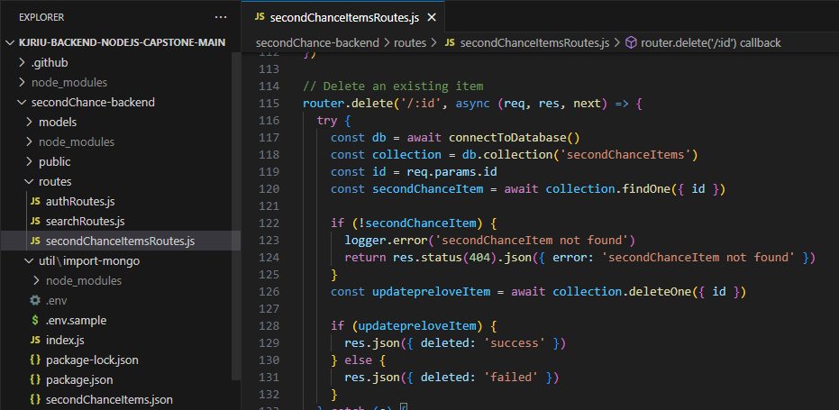

# JavaScript Back-end Capstone Project 

## db.js

## secondChanceItemsRoutes.js

## searchRoutes.js

## searchRoutes in app.js

##  import the natural npm package

## POST a file to the backend

## DELETE an item 
